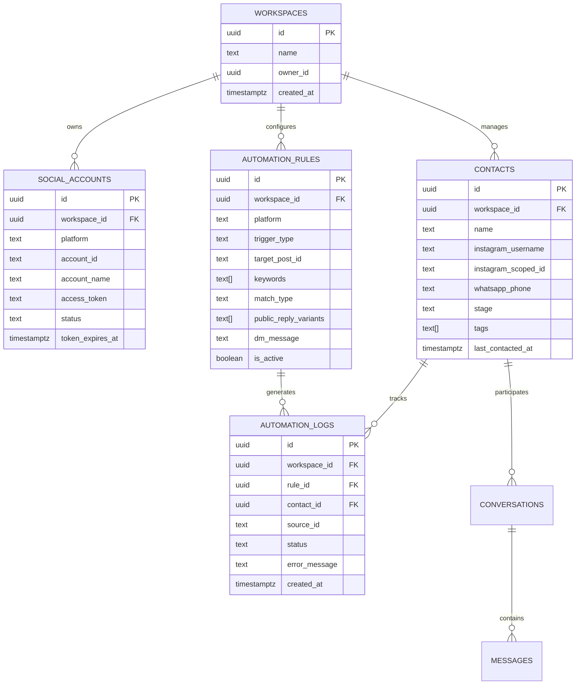

# Database Schema Specification

This document details the PostgreSQL schema designed for `salty-auto` inside Supabase. All tables feature **UUID primary keys**, **automatic timestamps**, and **Row-Level Security (RLS)**.

---

## 1. ER Diagram Overview

---

## 2. Table Definitions & Columns

### `auto_workspaces`
Multi-tenant boundary for agencies and businesses.
- `id` (UUID, Primary Key, default `gen_random_uuid()`)
- `name` (TEXT, NOT NULL)
- `owner_id` (TEXT, indexed) — Stores the authenticated Firebase User UID (`firebaseUser.uid`)
- `created_at` (TIMESTAMPTZ, default `now()`)
- `updated_at` (TIMESTAMPTZ, default `now()`)

### `auto_social_accounts`
Stores connected Meta credentials.
- `id` (UUID, Primary Key, default `gen_random_uuid()`)
- `workspace_id` (UUID, references `auto_workspaces(id)` ON DELETE CASCADE)
- `platform` (TEXT, NOT NULL, CHECK `platform IN ('instagram', 'whatsapp')`)
- `account_id` (TEXT, NOT NULL) — Instagram Business Account ID or WhatsApp Phone Number ID
- `account_name` (TEXT) — Human-readable account display name or handle
- `access_token` (TEXT, NOT NULL) — Long-lived access token
- `status` (TEXT, default `'active'`, CHECK `status IN ('active', 'expired', 'disconnected')`)
- `token_expires_at` (TIMESTAMPTZ)
- `created_at` (TIMESTAMPTZ, default `now()`)
- `updated_at` (TIMESTAMPTZ, default `now()`)
- *Unique Constraint*: `UNIQUE(workspace_id, platform, account_id)`

### `auto_automation_rules`
Stores the trigger-and-action rules configured by users.
- `id` (UUID, Primary Key, default `gen_random_uuid()`)
- `workspace_id` (UUID, references `auto_workspaces(id)` ON DELETE CASCADE)
- `social_account_id` (UUID, references `auto_social_accounts(id)` ON DELETE CASCADE)
- `name` (TEXT, NOT NULL) — Rule title (e.g. "Free E-Book Giveaway")
- `platform` (TEXT, NOT NULL, default `'instagram'`)
- `trigger_type` (TEXT, NOT NULL, default `'comment'`, CHECK `trigger_type IN ('comment', 'dm', 'keyword')`)
- `target_post_id` (TEXT, default `'all'`) — `'all'` or specific Instagram Media ID
- `keywords` (TEXT[], NOT NULL) — Array of trigger keywords e.g. `ARRAY['BOOK', 'FREE', 'PDF']`
- `match_type` (TEXT, default `'contains'`, CHECK `match_type IN ('contains', 'exact')`)
- `public_reply_variants` (TEXT[], NOT NULL) — Array of comment reply strings for anti-bot variation
- `dm_message` (TEXT, NOT NULL) — Direct Message copy sent to the user
- `is_active` (BOOLEAN, default `true`)
- `created_at` (TIMESTAMPTZ, default `now()`)
- `updated_at` (TIMESTAMPTZ, default `now()`)

### `auto_contacts`
The unified social CRM contact record.
- `id` (UUID, Primary Key, default `gen_random_uuid()`)
- `workspace_id` (UUID, references `auto_workspaces(id)` ON DELETE CASCADE)
- `name` (TEXT)
- `instagram_username` (TEXT)
- `instagram_scoped_id` (TEXT) — IGSID (Instagram Scoped User ID)
- `whatsapp_phone` (TEXT) — E.164 phone number (e.g. `+1234567890`)
- `stage` (TEXT, default `'lead'`, CHECK `stage IN ('lead', 'engaged', 'qualified', 'customer', 'lost')`)
- `tags` (TEXT[], default `ARRAY[]::TEXT[]`)
- `metadata` (JSONB, default `'{}'::jsonb`)
- `last_contacted_at` (TIMESTAMPTZ)
- `created_at` (TIMESTAMPTZ, default `now()`)
- `updated_at` (TIMESTAMPTZ, default `now()`)
- *Unique Constraint*: `UNIQUE(workspace_id, instagram_scoped_id)`, `UNIQUE(workspace_id, whatsapp_phone)`

### `auto_automation_logs`
Audit trail and deduplication log for processed automation events.
- `id` (UUID, Primary Key, default `gen_random_uuid()`)
- `workspace_id` (UUID, references `auto_workspaces(id)` ON DELETE CASCADE)
- `rule_id` (UUID, references `auto_automation_rules(id)` ON DELETE SET NULL)
- `contact_id` (UUID, references `auto_contacts(id)` ON DELETE SET NULL)
- `source_id` (TEXT, NOT NULL) — Meta `comment_id` or `message_id` for deduplication
- `platform` (TEXT, NOT NULL)
- `status` (TEXT, NOT NULL, CHECK `status IN ('success', 'failed', 'skipped', 'rate_limited')`)
- `error_message` (TEXT)
- `created_at` (TIMESTAMPTZ, default `now()`)
- *Unique Constraint*: `UNIQUE(workspace_id, source_id)` — Guarantees no event is processed twice!

---

## 3. Row-Level Security (RLS) Policies
- All `auto_*` tables have `ALTER TABLE ... ENABLE ROW LEVEL SECURITY;`.
- Users can only `SELECT`, `INSERT`, `UPDATE`, `DELETE` rows where `workspace_id` matches a workspace they own or belong to.
- Service role queries bypass RLS for background workers (Inngest webhooks).
